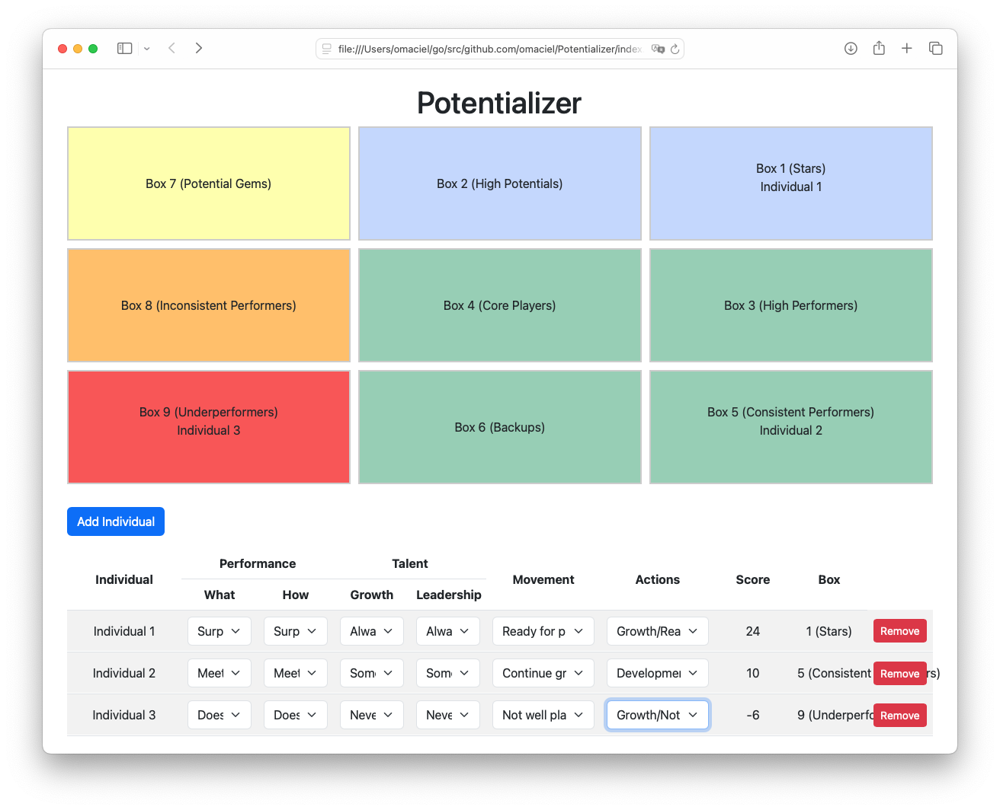

# Potentializer

**Potentializer** is a standalone, simple HTML-based 9-Box Talent Review tool designed for people managers to visually categorize and assess team members' performance and potential.

## About Potentializer

The 9-Box Talent Review is a tool commonly used in performance management and talent planning. It helps managers evaluate their team members based on two dimensions:

- **Performance**: How well an individual meets or exceeds job expectations.
- **Potential**: The individual's ability to grow into more complex roles in the future.

The Potentializer tool offers a straightforward interface where you can input performance and potential data for each team member and automatically assign them to one of nine boxes based on their scores.

## The 9-Box Grid

The 9-box grid consists of the following categories:

1. **Box 1: Stars (Surpasses Expectations + High Potential)** – [More Info](https://slidemodel.com/9-box-talent-review/#header_4)
2. **Box 2: High Potentials (Meeting Expectations + High Potential)** – [More Info](https://slidemodel.com/9-box-talent-review/#header_4)
3. **Box 3: High Performers (Surpasses Expectations + Growth Potential)** – [More Info](https://slidemodel.com/9-box-talent-review/#header_4)
4. **Box 4: Core Players (Meeting Expectations + Growth Potential)** – [More Info](https://slidemodel.com/9-box-talent-review/#header_4)
5. **Box 5: Consistent Performers (Surpasses Expectations + Modest Potential)** – [More Info](https://slidemodel.com/9-box-talent-review/#header_4)
6. **Box 6: Backups (Meeting Expectations + Modest Potential)** – [More Info](https://slidemodel.com/9-box-talent-review/#header_4)
7. **Box 7: Potential Gems (Does Not Meet Expectations + High Potential)** – [More Info](https://slidemodel.com/9-box-talent-review/#header_4)
8. **Box 8: Inconsistent Performers (Does Not Meet Expectations + Growth Potential)** – [More Info](https://slidemodel.com/9-box-talent-review/#header_4)
9. **Box 9: Underperformers (Does Not Meet Expectations + Modest Potential)** – [More Info](https://slidemodel.com/9-box-talent-review/#header_4)

## Features

- Simple, HTML-based UI
- Dynamic assignment of team members to the 9-box categories
- Easy input of performance and potential data via dropdowns
- Visualization of team members in their respective 9-box categories
- Lightweight, standalone, and easy to deploy

## How to Use

1. Clone the repository to your local machine.
2. Open the `index.html` file in a browser.
3. Add team members, assign performance and potential data, and visualize their placement in the 9-box grid.

## Useful Links

- [Learn more about the 9-Box Talent Review](https://slidemodel.com/9-box-talent-review/)
- [How to use the 9-Box in Performance Management](https://slidemodel.com/9-box-talent-review/#header_5)

## License

This project is open-source and available under the [MIT License](LICENSE).
